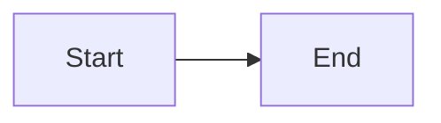

This documentation site is built with [Fumadocs](https://fumadocs.dev), a Next.js documentation framework. Pages are written in MDX — Markdown with JSX support.

_Components_ provide reusable UI elements with consistent styling. All components listed below are available globally in every MDX page — no imports needed. Many of them are thin wrappers over [Fumadocs UI components](https://fumadocs.dev/docs/ui/components).

## Using a component

Render any component as a JSX tag. Tags start with an uppercase letter matching the component name:

```mdx title="some/page.mdx"
<Aside>Here we go, some **nested content and formatting**!</Aside>
```

## Guidelines

Keep formatting as simple as possible. Avoid components when a paragraph communicates the same intent without them.

## Content components

### Aside

Callout boxes for secondary information: notes, tips, cautions, and dangers. See [detailed documentation](/overview/contribute/snippets/aside).

```mdx
<Aside>A note aside (default).</Aside>
<Aside type="caution">Watch out!</Aside>
```

<Aside>A note aside (default).</Aside>
<Aside type="caution">Watch out!</Aside>

### Steps and Step

Display sequential instructions in a numbered format.

```mdx
<Steps>
  <Step title="First step">
    Do something.
  </Step>
  <Step title="Second step">
    Do something else.
  </Step>
</Steps>
```

<Steps>
  <Step
    title="First step"
  >
    Do something.
  </Step>

  <Step
    title="Second step"
  >
    Do something else.
  </Step>
</Steps>

### Tabs and Tab

Tabbed content container. Each `<Tab>` needs a `title`.

```mdx
<Tabs>
  <Tab title="JavaScript">
    JavaScript example.
  </Tab>
  <Tab title="Python">
    Python example.
  </Tab>
</Tabs>
```

<Tabs>
  <Tab
    title="JavaScript"
  >
    JavaScript example.
  </Tab>

  <Tab
    title="Python"
  >
    Python example.
  </Tab>
</Tabs>

### CodeGroup

Wraps multiple fenced code blocks into a tabbed view. Each code block's `title` attribute becomes the tab label.

````mdx
<CodeGroup>
```javascript title="example.js"
const x = 1;
```

```python title="example.py"
x = 1
```
</CodeGroup>
````

<CodeGroup>
  ```javascript title="example.js"
  const x = 1;
  ```

  ```python title="example.py"
  x = 1
  ```
</CodeGroup>

### Accordion and AccordionGroup

Collapsible sections for progressive disclosure.

```mdx
<Accordion title="Click to expand">
  Hidden content revealed on click.
</Accordion>

<AccordionGroup>
  <Accordion title="First section">Content one.</Accordion>
  <Accordion title="Second section">Content two.</Accordion>
</AccordionGroup>
```

<Accordion
  title="Click to expand"
>
  Hidden content revealed on click.
</Accordion>

### Expandable

A lighter collapsible section using native HTML `<details>`.

```mdx
<Expandable title="Show more">
  Additional details here.
</Expandable>
```

<Expandable
  title="Show more"
>
  Additional details here.
</Expandable>

### Tooltip

Displays additional information on hover. Prefer linking to the [glossary](/foundations/glossary) or a reference page instead.

```mdx
<Tooltip tip="This appears on hover">Hover over me</Tooltip>
```

<Tooltip tip="This appears on hover">Hover over me</Tooltip>

## Layout components

### Card and CardGroup

Highlighted content containers with icons. Prefer regular Markdown lists and use cards only when links should stand out.

```mdx
<CardGroup cols={2}>
  <Card title="First card" icon="rocket" href="/overview/start-here">
    Description of the first card.
  </Card>
  <Card title="Second card" icon="code">
    Description of the second card.
  </Card>
</CardGroup>
```

<CardGroup cols={2}>
  <Card
    title="First card"
    icon="rocket"
    href="/overview/start-here"
  >
    Description of the first card.
  </Card>

  <Card
    title="Second card"
    icon="code"
  >
    Description of the second card.
  </Card>
</CardGroup>

### Columns

Alias for `<CardGroup>` — arranges children in responsive column layouts.

```mdx
<Columns cols={3}>
  <Card title="One">Content</Card>
  <Card title="Two">Content</Card>
  <Card title="Three">Content</Card>
</Columns>
```

## Media components

### Image

Display images with light/dark theme support, zoom, and optional clickable links. See [detailed documentation](/overview/contribute/snippets/image).

```mdx
<Image src="/resources/images/example.png" alt="Example" />

{/* Light and dark theme variants */}
<Image
  src="/resources/images/light.png"
  darkSrc="/resources/images/dark.png"
  alt="Themed image"
/>
```

### Mermaid diagrams

Use fenced code blocks with Mermaid.js syntax to create flowcharts, sequence diagrams, and more.

````mdx

````

### Icon

Renders a [Lucide](https://lucide.dev/icons) icon by name. Avoid using standalone unless icons in other components are insufficient.

```mdx
<Icon icon="rocket" size={24} />
```

<Icon
  icon="rocket"
  size={24}
/>

## Data components

### FileTree

Display directory structures with collapsible subdirectories.

```mdx
<FileTree items={[
  "README.md",
  { kind: "folder", name: "src", items: ["index.ts", "utils.ts"] },
  "package.json",
]} />
```

<FileTree
  items={["README.md", {
    kind: "folder",
    name: "src",
    items: ["index.ts", "utils.ts"]
  }, "package.json"]}
/>

### ResponseField and ParamField

Document API response fields and parameters.

```mdx
<ParamField name="address" type="string" required>
  The wallet address to query.
</ParamField>

<ResponseField name="balance" type="number">
  The wallet balance in nanotons.
</ResponseField>
```

<ParamField
  name="address"
  type="string"
  required
>
  The wallet address to query.
</ParamField>

<ResponseField
  name="balance"
  type="number"
>
  The wallet balance in nanotons.
</ResponseField>

### Badge

Inline labels and status indicators. Use sparingly — mainly for deprecated or outdated items.

```mdx
Regular text with a <Badge>default</Badge> badge.

<Badge variant="warning">deprecated</Badge> <Badge variant="success">new</Badge> <Badge variant="error">removed</Badge>
```

Regular text with a <Badge>default</Badge> badge.

<Badge variant="warning">deprecated</Badge> <Badge variant="success">new</Badge> <Badge variant="error">removed</Badge>

## Callout aliases

These components are shorthand aliases for `<Aside>` with specific types:

| Component   | Equivalent               |
| ----------- | ------------------------ |
| `<Note>`    | `<Aside type="note">`    |
| `<Info>`    | `<Aside type="note">`    |
| `<Tip>`     | `<Aside type="tip">`     |
| `<Warning>` | `<Aside type="caution">` |
| `<Caution>` | `<Aside type="caution">` |
| `<Danger>`  | `<Aside type="danger">`  |
| `<Check>`   | success callout          |

Prefer using `<Aside>` directly for consistency.

## Do not use

These components have better alternatives:

1. `<Callout>` — use [`<Aside>`](/overview/contribute/snippets/aside) instead for a unified interface.
1. `<Frame>` — use [`<Image>`](/overview/contribute/snippets/image) instead, which includes framing, zoom, and dark theme support.
1. `<Icon>` — do not use standalone unless icons in other components or code blocks are insufficient in the given case.

These components are currently unused:

1. `<Banner>` — reserved for special occasions and public releases.
1. `<Update>` — the documentation does not contain changelogs.

## Specialized components

These components are used in specific contexts:

- `<Stub issue={123}>` — placeholder for work-in-progress pages, with an optional link to a tracking issue.
- `<FenceTable>` — pre-formatted table display.
- `<CatchainVisualizer>` — catchain visualization (legacy).
- `<TvmInstructionTable>` — TVM instruction reference table (legacy).

## Custom components

TON documentation includes custom components built for various needs. See items on the left navigation panel within the "Components and snippets" group under the "Contribute" section, such as: [Aside](/overview/contribute/snippets/aside), [Image](/overview/contribute/snippets/image), etc.

## Styling

Fumadocs uses [Tailwind CSS v4](https://tailwindcss.com/docs) as its styling foundation. Tailwind utility classes can be used directly in MDX pages on HTML elements.

Related resources:

- [Fumadocs documentation](https://fumadocs.dev)
- [Tailwind CSS v4 documentation](https://tailwindcss.com/docs)
- [Unofficial Tailwind CSS cheatsheet](https://tailwindcss.504b.cc/)
